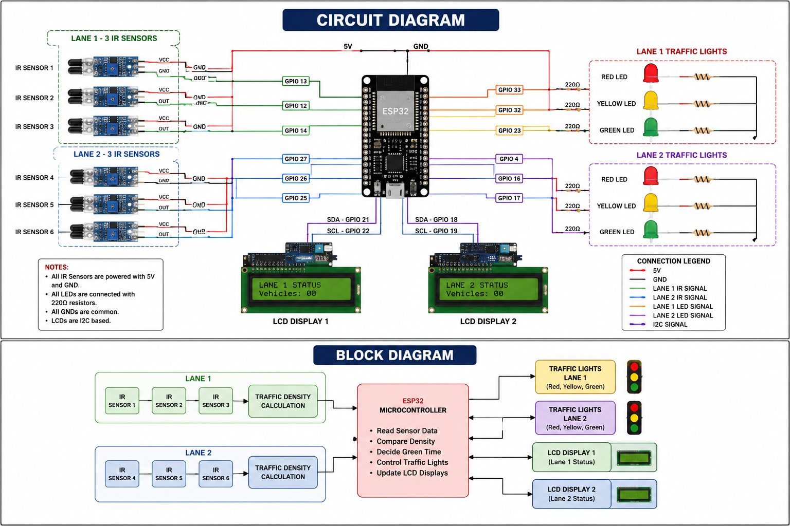
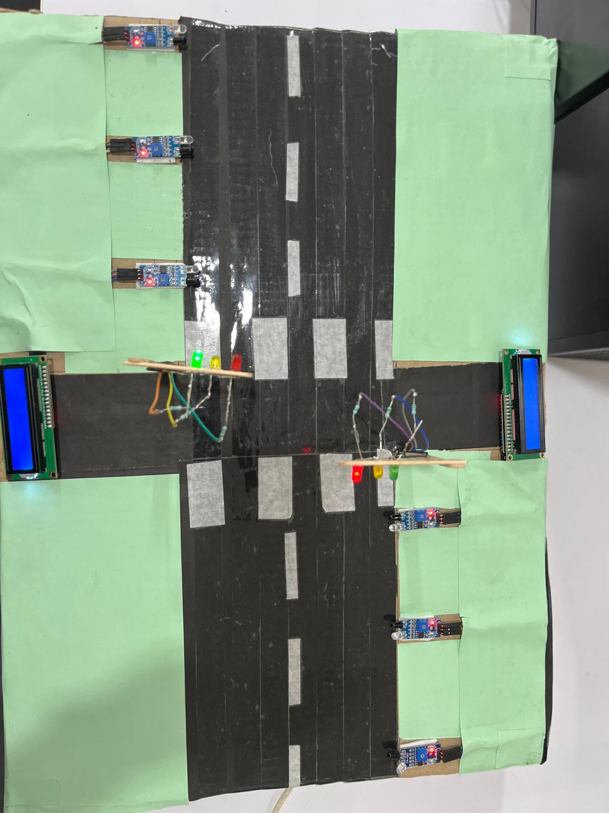
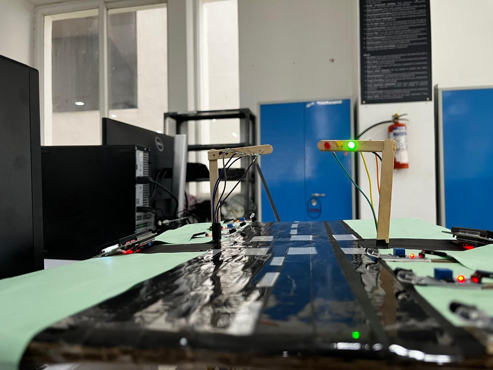
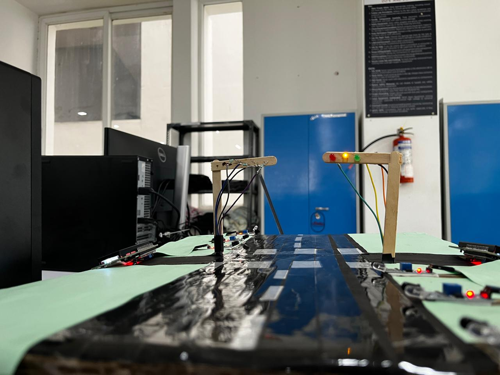

# Adaptive Traffic Control System using ESP32, IR Sensors, and LCD Display

## Overview

Traffic congestion is a major issue in modern cities due to increasing vehicle density and inefficient fixed-time traffic signals. Traditional systems allocate equal signal timing to all roads regardless of traffic volume, causing unnecessary waiting, fuel wastage, and traffic buildup.

This project presents an **Adaptive Traffic Control System using ESP32, IR Sensors, and LCD Displays**, designed to intelligently manage traffic flow based on real-time vehicle density. The system uses multiple IR sensors in each lane to detect congestion levels and dynamically adjusts signal timings accordingly. LCD displays provide live traffic status information for each lane.

This project demonstrates practical embedded system design for smart traffic automation and future smart city infrastructure.

---

## Objective

To design and implement an intelligent traffic control system that dynamically adjusts signal timing based on vehicle density using ESP32 and IR sensors.

### Objectives:
- Detect vehicle density in real time
- Reduce traffic congestion
- Minimize waiting time
- Improve traffic flow efficiency
- Display live traffic information using LCDs
- Create a scalable smart traffic solution

---

## Key Features

- Real-time vehicle density detection
- Adaptive traffic signal timing
- ESP32-based fast decision making
- Dual lane traffic management
- LCD display for live lane information
- Low-cost embedded implementation
- Suitable for smart city applications

---

## Technologies Used

### Hardware
- ESP32 Development Board
- IR Sensors (6)
- LCD Displays (2)
- Traffic LEDs
- Resistors
- Breadboard
- Jumper Wires
- Power Supply

### Software
- Arduino IDE
- Embedded C / Arduino Programming

---

## Components Required

| Component | Quantity |
|---------|---------|
| ESP32 Development Board | 1 |
| IR Sensors | 6 |
| LCD Displays | 2 |
| Red LEDs | 2 |
| Yellow LEDs | 2 |
| Green LEDs | 2 |
| Resistors | As required |
| Breadboard | 1 |
| Jumper Wires | As required |
| Power Supply | 1 |

---

## System Architecture

```text
Lane 1 (3 IR Sensors)
        |
        |
        |------ ESP32 Controller ------ Traffic LEDs
        |
        |
Lane 2 (3 IR Sensors)

        |
    LCD Display 1
    LCD Display 2
    ---

## Circuit Diagram



---

## Project Images

### Prototype Top View


### Working Demo 1


### Working Demo 2


---

## Demo Video

Download/View Demo: [Project Demo Video](project_demo.mp4)

---

## Future Scope

- AI-based traffic prediction
- Emergency vehicle priority management
- IoT cloud monitoring
- Mobile app integration
- Multi-junction traffic synchronization
- Smart city deployment

---

## Applications

- Smart city traffic management
- Urban traffic congestion control
- Automated traffic signal systems
- Educational embedded systems project
- Research prototype for smart transportation

---

## Author

**Girish Pasupuleti**  
Computer Science Engineering (AI & ML)  
GitHub: https://github.com/Girish-Pasupuleti

---

## License

This project is licensed under the MIT License.
